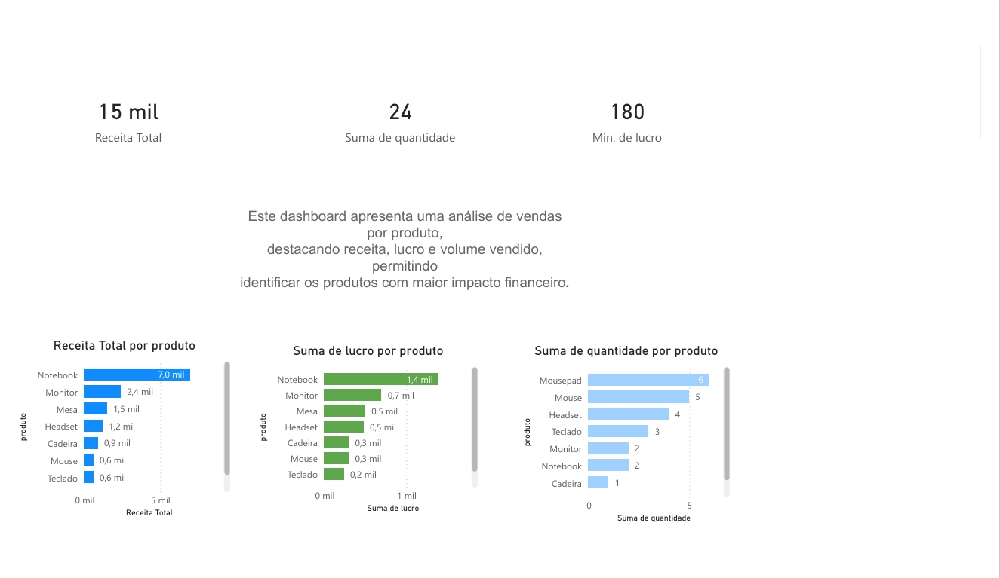

📊 Dashboard de Vendas — Power BI
🎯 Objetivo do Projeto

Desenvolver um dashboard interativo no Power BI com foco na análise de desempenho de vendas, utilizando indicadores-chave de negócio (KPIs) e visualizações claras para apoiar a tomada de decisão.

Este projeto teve como objetivo transformar dados brutos em insights acionáveis, explorando faturamento, volume de vendas, lucro e comportamento dos produtos ao longo do tempo, simulando um cenário real de análise de negócios.

🛠️ Tecnologias Utilizadas

Power BI

Power Query (tratamento e transformação de dados)

Modelagem de dados

DAX (nível básico)

Dataset em CSV

📌 Principais KPIs

💰 Faturamento Total

📦 Volume de Vendas

📈 Lucro

🧾 Ticket Médio

📊 Crescimento mensal de vendas

🔍 Análises Realizadas

Evolução do faturamento ao longo do tempo

Comparação de desempenho por categoria de produto

Análise de vendas por produto

Identificação de produtos com maior impacto financeiro

Uso de filtros interativos para exploração dos dados

🧠 Principais Insights

Identificação dos produtos mais relevantes para o faturamento total

Compreensão da distribuição do lucro entre diferentes categorias

Visualização clara do volume de vendas por produto

Apoio à tomada de decisões estratégicas com base em dados

## 📊 Dashboard

📚 Aprendizados e Experiência

Durante o desenvolvimento deste projeto, pude:

Utilizar o Power Query para limpeza, padronização e transformação dos dados antes da análise

Consolidar o uso do Power BI na prática, desde a importação até a visualização dos dados

Aplicar conceitos de modelagem de dados para organizar corretamente as tabelas e relacionamentos

Criar medidas simples em DAX para cálculo de KPIs

Melhorar a organização visual e escolha de gráficos, priorizando clareza e leitura dos dados

Desenvolver uma visão mais analítica sobre como dados bem tratados impactam diretamente a tomada de decisão

Este projeto representou um avanço importante na minha formação como Analista de Dados, conectando tratamento de dados, análise e visualização em um único fluxo de trabalho.

Projeto desenvolvido com foco em boas práticas de análise de dados e visualização, simulando um cenário real de negócios.
